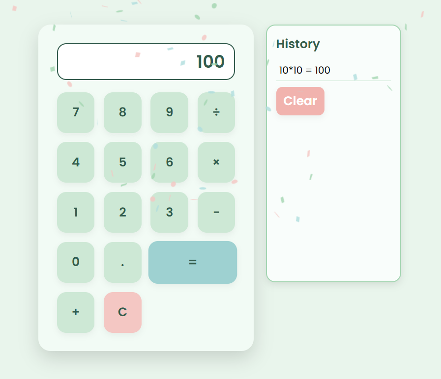

# Pastel-Themed Calculator 

A cute and minimal web-based calculator with a sage green pastel aesthetic, adorable sound effects, and a user-friendly interface.



---

## Features

- 💡 Basic arithmetic operations (Add, Subtract, Multiply, Divide)
- 💡 Clear all button
- 💡 Error sound effects
- 💡 Sage green pastel theme
- 💡 Subtle display glow
- 💡 History display to view past calculations

---

## Technologies Used

- HTML
- CSS
- JavaScript
- Sound effects (custom MP3)
- Cute UI Design 🎀

---

## How to Run

Clone this repository:
   ```bash
   git clone https://github.com/VANSHIKADIXIT16/Micro-IT-Internship.git

cd Micro-IT-Internship

Open the calculator.html file in your browser
