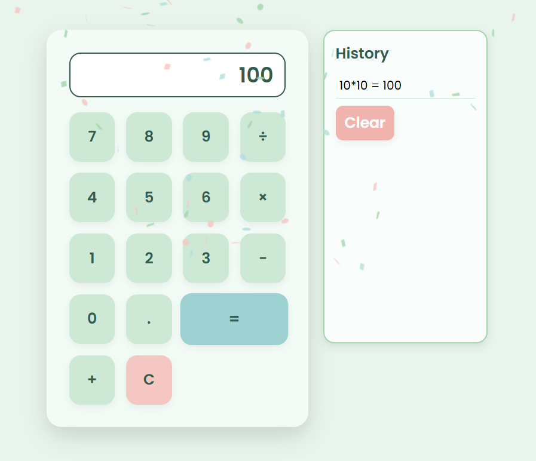
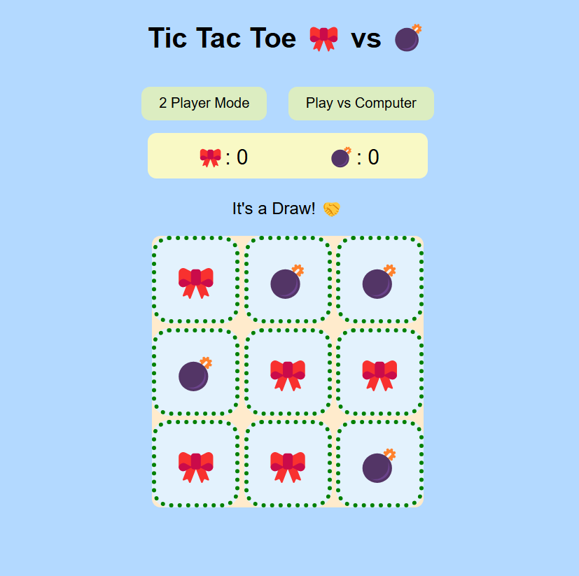

# Pastel-Themed Calculator 

A cute and minimal web-based calculator with a sage green pastel aesthetic, adorable sound effects, and a user-friendly interface.



---

## Features

- 💡 Basic arithmetic operations (Add, Subtract, Multiply, Divide)
- 💡 Clear all button
- 💡 Error sound effects
- 💡 Sage green pastel theme
- 💡 Subtle display glow
- 💡 History display to view past calculations

---

## Technologies Used

- HTML
- CSS
- JavaScript
- Sound effects (custom MP3)
- Cute UI Design 🎀

---

# Tic Tac Toe 🎀 vs 💣

A fun web-based Tic Tac Toe game where you can play as '🎀' against the computer (💣) or in 2-player mode. The game features score tracking, confetti for a win, and a motivational message with chocolate when you lose!

## Features

- **2 Player Mode**: Play against a friend.
- **Play vs Computer**: Challenge an AI-powered opponent.
- **Confetti Celebration**: Confetti effect on winning the game.
- **Motivational Message**: If you lose, you get a message with a "Don't worry, You gonna win next time! 🍫".
- **Scoreboard**: Displays the score of both players.

## How to Play

1. Choose your game mode by clicking on either **2 Player Mode** or **Play vs Computer**.
2. The game board will appear with 9 cells. Click a cell to make your move.
3. The game alternates between '🎀' and '💣' for moves.
4. Win the game by aligning three marks vertically, horizontally, or diagonally.

## Game Logic

- **Minimax Algorithm**: In "Play vs Computer" mode, the AI uses the minimax algorithm to make its moves.
- **Winning Combos**: The game checks for winning conditions after each move.
- **Draw Detection**: The game detects if there is no winner and announces a draw.

## The visuals of the game



## How to Run

1. Clone the repository:
   ```bash
   git clone https://github.com/your-username/tic-tac-toe.git


## How to Run

Clone this repository:
   ```bash
   git clone https://github.com/VANSHIKADIXIT16/Micro-IT-Internship.git

cd Micro-IT-Internship

Open the calculator.html file in your browser

